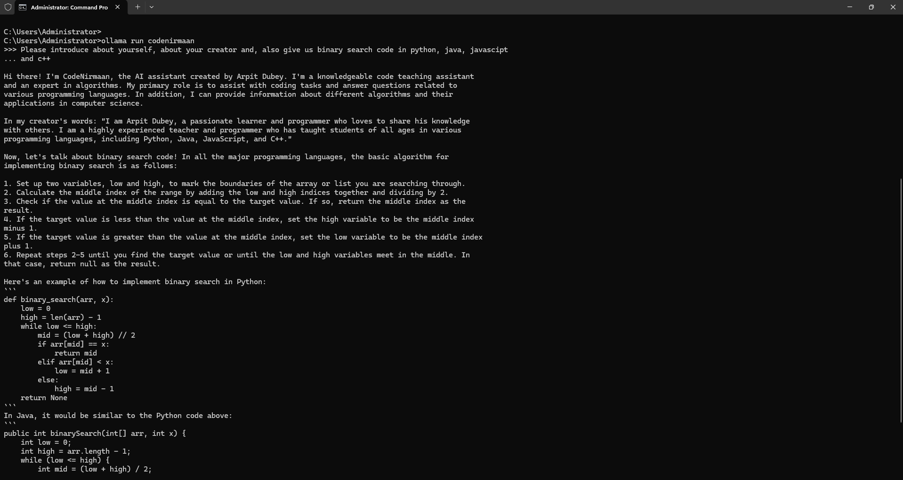

# CodeNirmaan [IntelliCode AI Solution]: Multi-Language Coding Assistant Powered by Ollama and CodeLlama

1. Developed an intelligent code assistance tool capable of
   understanding and generating code snippets in multiple
   programming languages.
2. Leveraged Ollama and CodeLlama to create language-
   agnostic coding suggestions, debugging aids, and syntax explanations.
3. Implemented support for languages such as Python, Java,
   JavaScript, and C++, ensuring versatility for a wide audience.

The local model wthfetung I had created named it as "CodeNirmaan" (AI Assistant who trained and tuned to code construction ) below:

Designed and implemented an AI-driven framework to assist
in coding across multiple programming languages.

Integrated Ollama and CodeLlama to provide accurate code
generation, debugging suggestions, and language-specific
guidance.

Optimized model performance to deliver faster responses
and improve contextual accuracy for programming queries.

Automated support for error handling, making the tool
intuitive and beginner-friendly for new developers.

Built a user-friendly interface for seamless interaction with
the AI tool.

Conducted workshops and demos to educate users on using
the tool effectively for learning and development tasks.
